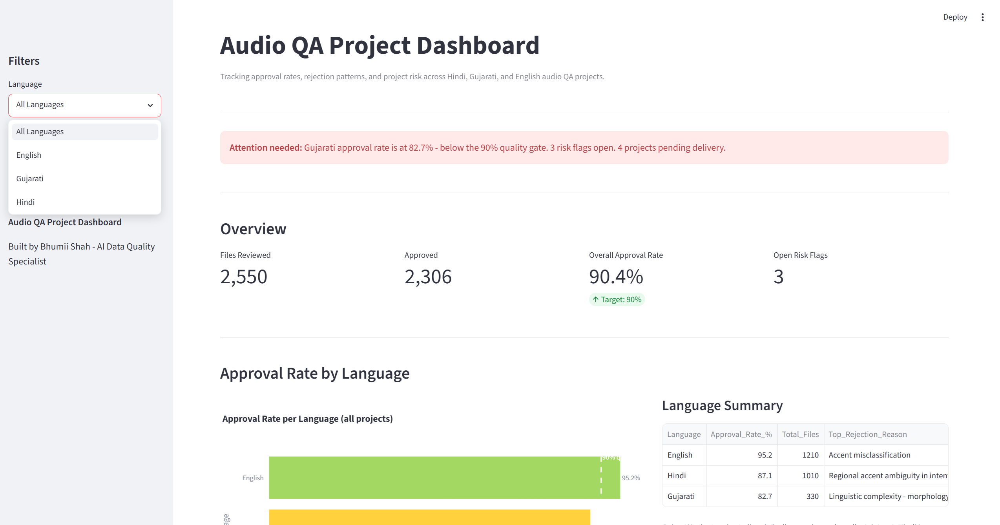
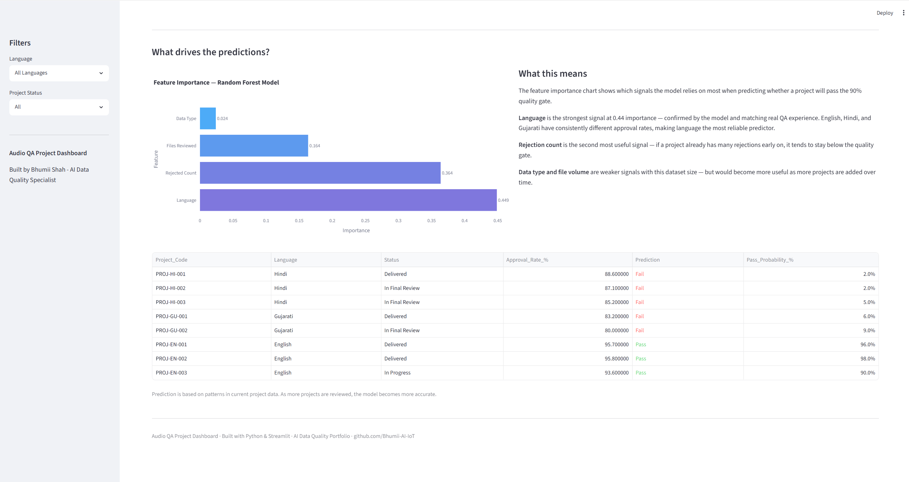
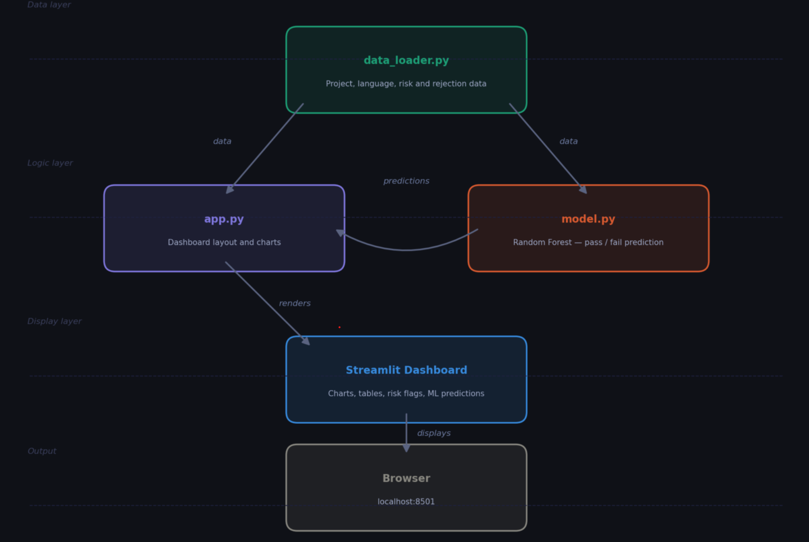

# Audio QA Project Dashboard
A project health and quality tracking dashboard for multilingual audio and conversational AI data — built with Python and Streamlit.

## Live Demo

[View the live dashboard here](https://audio-app-dashboard-nun6jt8bkandqfhza9xpsv.streamlit.app/)

> This is a personal learning project. It is not connected to my employer, and all data is synthetic.

## What This Is

I work as an AI Data Quality Specialist reviewing audio and conversational AI training data across three languages — Hindi, Gujarati, and English.

This dashboard gives me visibility of quality across projects. Instead of waiting for feedback on where things need improving, I wanted to track it myself. So I built this.

It shows approval rates by language, rejection patterns, delivery status across projects, and active risk flags — the kind of view a QA lead or project manager needs in one place.

## Why I Built This

My background is in Global Project Management (MSc University of Essex) but my day to day work is in AI data quality. This dashboard is where those two things meet.

I taught myself Python and built this as part of my own learning — not for a course, not for work, but because I wanted to turn the patterns I notice in my QA work into something visible and useful.

Before this, I relied on feedback from my manager to know where quality needed attention. Now I can see it myself.

## My Background

I studied Electronics and Communications Engineering in India before completing an MSc in Global Project Management at the University of Essex, London.

That combination — engineering fundamentals, project management methodology, and hands-on AI data quality work — is what this dashboard reflects.

Audio data quality is not just about catching errors. It is about understanding the full pipeline from signal to model output. My ECE background gives me a technical foundation for understanding audio data at a deeper level than a typical QA reviewer.

## Dashboard Preview

### Overview & QA Metrics


### Recommendations & Early Risk Prediction


## Project Architecture



## What It Shows

- **Auto Summary Insight** — banner at the top that automatically surfaces the most important finding from the data
- **Approval Rate by Language** — which languages are meeting the 90% quality gate and which are not
- **Rejection Reason Breakdown** — the most common errors caught during final QA review
- **Project Tracker** — delivery status across all active projects
- **Risk Flag Monitor** — open blockers with severity levels and descriptions
- **Early Risk Prediction** — a Random Forest model predicts which projects will finish below the 90% quality gate, using only signals available in the first weeks of a project
- **Recommendations** — based on real patterns observed during daily QA review

## Key Findings

These are not things I read somewhere — they come from doing the reviews myself every day:

- **Gujarati** is the hardest language to QA — linguistically complex and the smallest dataset
- **Hindi** suffers from regional accent variation that annotation guidelines do not fully account for
- **English** is the most consistent but accent misclassification still appears regularly

## ML Model - Risk Prediction

The dashboard includes a Random Forest classifier that predicts which
projects will finish below the 90% quality gate — using only signals
available in the first weeks, before the outcome is known.

**Why Random Forest:**
- Handles mixed data types (language category + numeric metrics)
- Shows which factors matter most (feature importance)
- Fast predictions for real-time dashboard updates
- Results are interpretable — I can explain WHY a project is flagged

**Features the model uses:**
- Language (Hindi, Gujarati, English)
- Audio data type
- Planned file volume
- Annotator count and native speaker share
- Guideline age
- Rejection rate on the first 10% of files

**Performance:**

| Metric | Score |
|---|---|
| 5-fold cross-validation | 87.6% (± 2.7%) |
| Held-out accuracy | 90.7% on 75 unseen projects |
| Precision | 97.1% |
| Recall | 85.0% |

I lead with the cross-validation figure rather than the held-out one.
When I reran the training across seven different random seeds, held-out
accuracy moved between 80% and 91% — the 90.7% is the top of that range.
Cross-validation re-splits and averages, so it moves far less. 87.6% is
the number I would defend.

**Note on the data:** the project history behind this model is synthetic.
It is generated to reflect patterns I observe reviewing Hindi, Gujarati
and English audio, but it contains no client data and no real project
records.

**Result:**
Projects at risk are flagged before final review, giving teams time to
improve rather than discovering problems at the end.

## What I Got Wrong First

The first version of this model reported 100% accuracy and I was pleased
with it. It was wrong, and the mistake is worth writing down.

I gave the model `Files_Reviewed` and `Rejected` as inputs, then asked it
to predict whether approval rate fell below 90%. But approval rate is
calculated as:

approval_rate = 1 - (rejected / files_reviewed)

So the two features I handed it were the two numbers the answer is
calculated from. It scored 100% because it was doing division, not
learning. This is called **target leakage**.

The part that took me longest to accept: more data would not have fixed
this, and neither would a train/test split. The leak was in the features
themselves, so it travels into the test set with them.

The fix was to change the question. Instead of *"given the finished
numbers, did it fail?"* — which you already know — the model now answers
*"given the setup and the first batch, will it fail?"* That version is
worth having, because there is still time to act on the answer.

Understanding this changed how I look at every feature I put into a
model: can I actually know this before the outcome?

## Tech Stack

- Python
- Streamlit
- Pandas
- Plotly
- Scikit-learn
- Matplotlib

## How to Run It

```bash
pip install -r requirements.txt
streamlit run app.py
```

## About Me

AI Data Quality Specialist based in London, working on 
multilingual audio and conversational AI training data.

BSc Electronics and Communications Engineering
MSc Global Project Management, University of Essex

I sit at the intersection of engineering, project management, 
and AI data quality. I am teaching myself Python and building 
tools that connect my day to day QA work with the kind of 
visibility a project manager needs.

This dashboard is one of those tools.